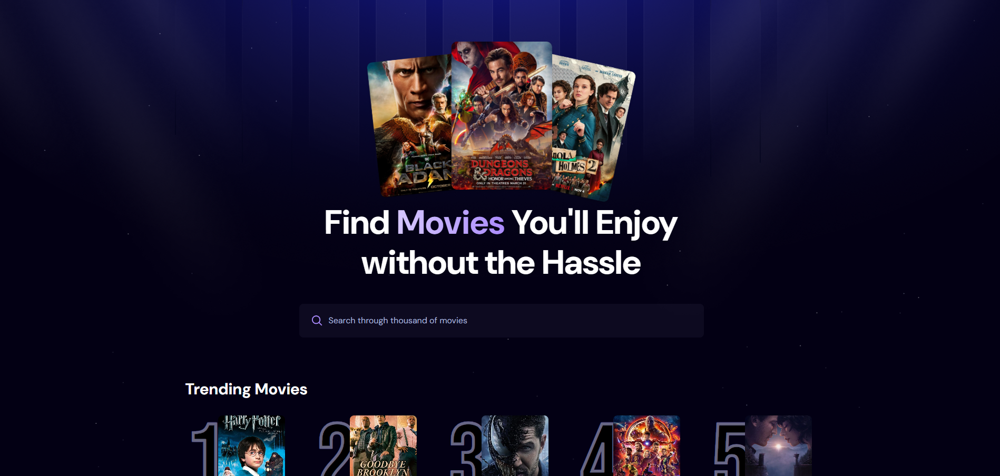
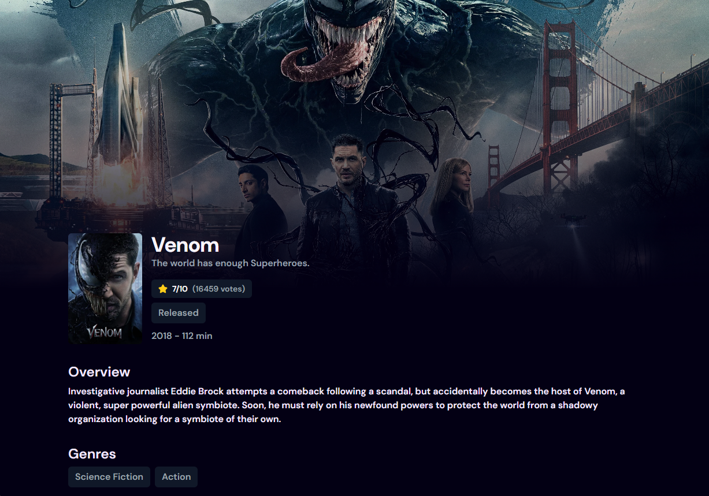
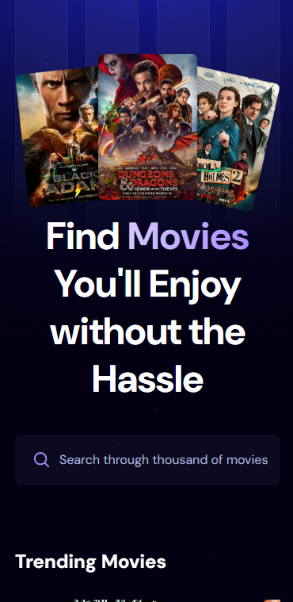



# 🎬 MovieFlix App

  

>  **Find Movies You'll Enjoy — Without the Hassle**

  

A sleek movie discovery platform built with **React** for Web and **React Native** for mobile. It lets users search, browse trending movies, and view detailed information — all powered by the TMDB API.

  

---

  

## 🖼️ Preview

  

### 🌐 Desktop Version

  

### 📱 Mobile Version

  

---

  

## 🚀 Features

  

- 🔍 Search new and upcoming movies

- 🎥 View trending titles

- ⭐ Check ratings, vote counts, and detailed overviews

- 📱 Fully responsive experience across platforms

  

---  

## 🛠️ Tech Stack

  

### 💻 Web (React)

- React

- React Router

- Vite

- TailwindCSS

- Appwrite

- TMDB API

  

### 📱 Mobile (React Native)

- React Native

- Expo

- TypeScript

- Appwrite

- TailwindCSS

- TMDB API
---

  

## 📂 Folder Structure

    .
    ├── React/                      # React app (web)
    │   ├── public/
    │   ├── src/
    │   └── .env.local                # ← add this file
    ├── ReactNative/                       # React Native app
    │   ├── app/
    │   ├── assets/
    │   ├── components/
    │   ├── constants/
    │   ├── interfaces/
    │   ├── services/
    │   ├── types/
    │   └── .env                      # ← add this file
    └── README.md

---

## ⚙️ Project Setup

To run the project locally, you’ll need to set up environment variables for both **React (web)** and **React Native** apps.

### 1. `.env.local` (for React Web) – _**add this file**_

Path: `React/.env.local`

    VITE_TMDB_API_KEY=your-api-key
    VITE_APPWRITE_PROJECT_ID=your-appwrite-project-code
    VITE_APPWRITE_DATABASE_ID=your-appwrite-database-code
    VITE_APPWRITE_COLLECTION_ID=your-appwrite-collection-code

### 2. `.env` (for React Native) – _**add this file**_

Path: `ReactNative/.env`

    EXPO_PUBLIC_MOVIE_API_KEY=your-api-key
    EXPO_PUBLIC_APPWRITE_PROJECT_ID=your-appwrite-project-code
    EXPO_PUBLIC_APPWRITE_DATABASE_ID=your-appwrite-database-code
    EXPO_PUBLIC_APPWRITE_COLLECTION_ID=your-appwrite-collection-code

---

## 🧪 Run Locally

### 📦 React Web

    cd desktop
    npm install
    npm run dev

### 📱 React Native (Expo)

    cd mobile
    npm install
    npx expo start

---

> 💡 Made with ❤️ using React, React Native & Expo  
> 📽️ Powered by TMDB API & Appwrite  
> 🚀 Feel free to fork, star, and contribute!
